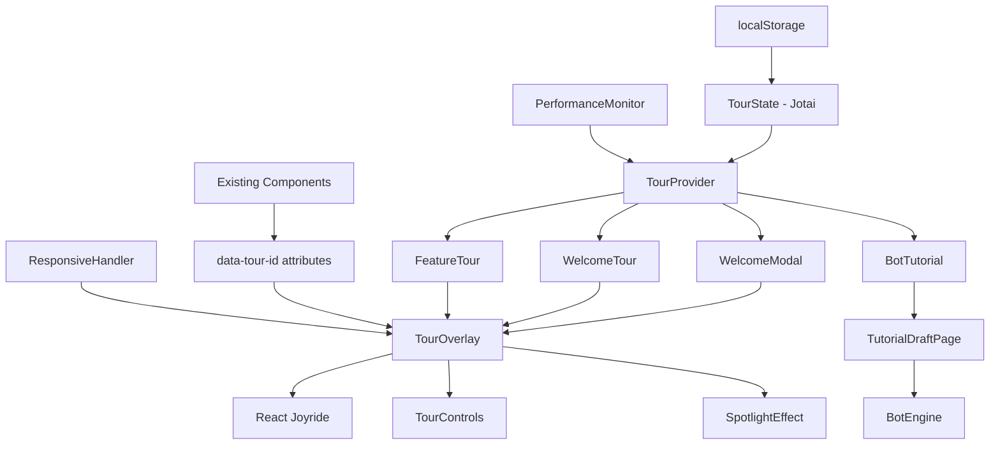
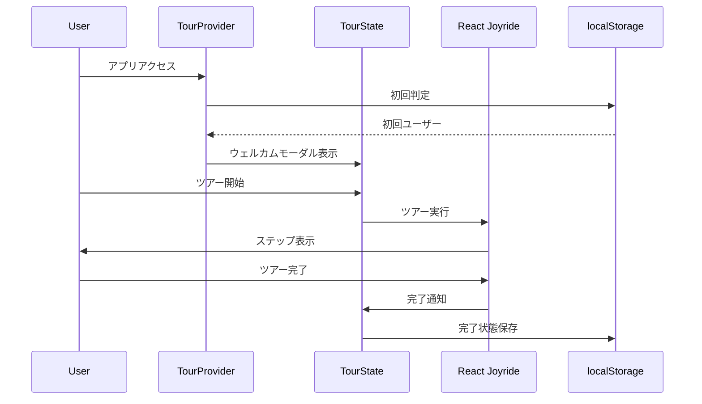

# Design Document

## Overview

OnlineDraftアプリのガイドツアー機能は、React Joyrideライブラリを基盤とした包括的なユーザーオンボーディングシステムです。初回ユーザー向けのウェルカムツアー、既存ユーザー向けの機能別ヘルプ、そしてBOT対戦チュートリアルの3つの主要コンポーネントで構成されます。既存のアプリケーション構造を最大限活用しながら、非侵入的な実装を実現し、200ms以内の高速レスポンスと60fpsのスムーズなアニメーションを保証します。

**設計原則:**
- **非侵入性**: 既存コンポーネントへの変更を最小限に抑制
- **高性能**: 200ms以内のツアー開始、60fps維持のアニメーション
- **レスポンシブ**: モバイルファーストでデスクトップまで対応
- **オフライン対応**: BOTチュートリアルはFirebase不要で動作

## Architecture

### システム全体構成



### データフロー設計



## Components and Interfaces

### 1. TourProvider Component

**責任**: ツアー全体の状態管理とコンテキスト提供

```typescript
type TourProviderProps = {
  children: React.ReactNode;
}

type TourContextValue = {
  currentTour: TourType | null;
  isRunning: boolean;
  showWelcomeModal: boolean;
  startTour: (tourType: TourType) => void;
  stopTour: () => void;
  skipTour: () => void;
  tourProgress: TourProgress;
  setWelcomeModalVisible: (visible: boolean) => void;
}

type TourType = 'welcome' | 'feature-share' | 'feature-chat' | 'bot-tutorial';

type TourProgress = {
  currentStep: number;
  totalSteps: number;
  canGoBack: boolean;
  canGoNext: boolean;
  canSkip: boolean;
}
```

### 2. WelcomeModal Component

**責任**: 初回ユーザー向けウェルカムモーダルの表示

```typescript
type WelcomeModalProps = {
  isOpen: boolean;
  onStartTour: () => void;
  onSkip: () => void;
  onClose: () => void;
}

type WelcomeModalContent = {
  title: string;
  description: string;
  tourButtonText: string;
  skipButtonText: string;
  features: WelcomeFeature[];
}

type WelcomeFeature = {
  icon: React.ReactNode;
  title: string;
  description: string;
}
```

### 3. TourOverlay Component

**責任**: React Joyrideのラッパーとカスタマイズ

```typescript
type TourOverlayProps = {
  steps: TourStep[];
  isOpen: boolean;
  onCallback: (data: CallBackProps) => void;
  tourType: TourType;
  isMobile: boolean;
}

type TourStep = {
  target: string;
  content: React.ReactNode;
  placement?: 'top' | 'bottom' | 'left' | 'right' | 'auto';
  disableBeacon?: boolean;
  spotlightClicks?: boolean;
  hideCloseButton?: boolean;
  hideFooter?: boolean;
  styles?: TourStepStyles;
  mobileContent?: React.ReactNode; // モバイル専用コンテンツ
}

type TourStepStyles = {
  options: {
    primaryColor: string;
    width: number | string;
    zIndex: number;
  };
  spotlight: {
    backgroundColor: string;
    border: string;
  };
  tooltip: {
    fontSize: number;
    padding: number;
  };
}
```

### 4. TourControls Component

**責任**: ツアーナビゲーションコントロールの提供

```typescript
type TourControlsProps = {
  currentStep: number;
  totalSteps: number;
  canGoBack: boolean;
  canGoNext: boolean;
  canSkip: boolean;
  onBack: () => void;
  onNext: () => void;
  onSkip: () => void;
  onClose: () => void;
  isMobile: boolean;
}

type TourControlsState = {
  isVisible: boolean;
  position: 'bottom' | 'floating';
  showProgress: boolean;
}
```

### 5. BotTutorial Component

**責任**: BOT対戦チュートリアルの実行

```typescript
type BotTutorialProps = {
  onComplete: () => void;
  onExit: () => void;
}

type BotCharacter = {
  id: 'akiko' | 'ryo' | 'maya';
  name: 'アキコ' | 'リョウ' | 'マヤ';
  avatar: number;
  strategy: 'popular' | 'random' | 'strategic';
  personality: BotPersonality;
  thinkingTime: [number, number]; // [min, max] in seconds
}

type BotPersonality = {
  chatMessages: string[];
  selectionPreferences: string[];
  conflictBehavior: 'aggressive' | 'defensive' | 'balanced';
}

type TutorialScenario = {
  id: 'movie-night';
  title: '今夜の映画、何観る？';
  items: string[];
  rounds: number;
  description: string;
}
```

### 6. SpotlightEffect Component

**責任**: ツアー対象要素のハイライト効果

```typescript
type SpotlightEffectProps = {
  target: string;
  isActive: boolean;
  spotlightPadding: number;
  backgroundColor: string;
  borderRadius: number;
}

type SpotlightPosition = {
  top: number;
  left: number;
  width: number;
  height: number;
}
```

## Data Models

### TourState (Jotai Atoms)

```typescript
// メインツアー状態
export const tourStateAtom = atom<TourState>({
  currentTour: null,
  isRunning: false,
  currentStep: 0,
  totalSteps: 0,
  isFirstTime: true,
  completedTours: [],
  showWelcomeModal: false
});

// ウェルカムモーダル状態
export const welcomeModalStateAtom = atom<WelcomeModalState>({
  isVisible: false,
  hasBeenShown: false,
  userChoice: null // 'tour' | 'skip' | null
});

// BOTチュートリアル状態
export const botTutorialStateAtom = atom<BotTutorialState>({
  isActive: false,
  currentRound: 0,
  scenario: {
    id: 'movie-night',
    title: '今夜の映画、何観る？',
    items: [
      'アクション映画', 'コメディ映画', 'ホラー映画', 'ロマンス映画',
      'SF映画', 'ドキュメンタリー', 'アニメ映画', 'ミュージカル'
    ],
    rounds: 3,
    description: 'みんなで今夜観る映画を決めよう！'
  },
  bots: [
    {
      id: 'akiko',
      name: 'アキコ',
      avatar: 1,
      strategy: 'popular',
      personality: {
        chatMessages: ['楽しそう！', 'これいいね〜', 'みんなはどう思う？'],
        selectionPreferences: ['人気のもの', '話題のもの'],
        conflictBehavior: 'balanced'
      },
      thinkingTime: [0.8, 1.2]
    },
    {
      id: 'ryo',
      name: 'リョウ',
      avatar: 5,
      strategy: 'strategic',
      personality: {
        chatMessages: ['戦略的に行こう', 'これは狙い目だな', '計算通り'],
        selectionPreferences: ['戦略的選択', '他人と被らないもの'],
        conflictBehavior: 'aggressive'
      },
      thinkingTime: [1.0, 1.5]
    },
    {
      id: 'maya',
      name: 'マヤ',
      avatar: 3,
      strategy: 'random',
      personality: {
        chatMessages: ['どれにしようかな〜', '迷っちゃう！', 'えいっ！'],
        selectionPreferences: ['直感的選択', 'ランダム'],
        conflictBehavior: 'defensive'
      },
      thinkingTime: [0.5, 1.0]
    }
  ],
  userSelections: [],
  botSelections: [],
  gameHistory: []
});

// ツアー進行状態
export const tourProgressAtom = atom<TourProgressState>({
  currentStep: 0,
  totalSteps: 0,
  canGoBack: false,
  canGoNext: true,
  canSkip: true,
  isLoading: false,
  error: null
});
```

## Mobile Responsiveness

### レスポンシブ設計戦略

**ブレークポイント定義:**
- Mobile: < 768px
- Tablet: 768px - 1024px  
- Desktop: > 1024px

**モバイル最適化:**

1. **ツアーステップの調整**
   - ポップオーバーサイズの動的調整
   - テキスト量の自動短縮
   - タッチターゲットサイズ最適化（44px以上）

2. **レイアウト適応**
   - スポットライト効果の位置調整
   - ナビゲーションコントロールの配置変更
   - モーダルサイズの画面サイズ対応

3. **パフォーマンス考慮**
   - モバイル向けアニメーション軽量化
   - タッチイベント最適化
   - バッテリー消費抑制

```typescript
type ResponsiveConfig = {
  mobile: {
    maxTooltipWidth: number;
    spotlightPadding: number;
    animationDuration: number;
    touchTargetSize: number;
  };
  tablet: {
    maxTooltipWidth: number;
    spotlightPadding: number;
    animationDuration: number;
  };
  desktop: {
    maxTooltipWidth: number;
    spotlightPadding: number;
    animationDuration: number;
  };
}
```

## Performance Optimization

### パフォーマンス要件と実装戦略

**目標指標:**
- ツアー開始: 200ms以内
- アニメーション: 60fps維持
- メモリ使用量: 10MB以下増加

**最適化手法:**

1. **遅延読み込み**
   ```typescript
   const TourOverlay = React.lazy(() => import('./TourOverlay'));
   const BotTutorial = React.lazy(() => import('./BotTutorial'));
   ```

2. **メモ化とキャッシュ**
   ```typescript
   const memoizedTourSteps = useMemo(() => generateTourSteps(tourType), [tourType]);
   const cachedBotBehavior = useCallback(botBehaviorCache.get, []);
   ```

3. **非同期処理最適化**
   - Web Workers活用でBOT思考処理を分離
   - requestAnimationFrameでアニメーション最適化
   - Intersection Observer APIで要素監視

4. **バンドルサイズ削減**
   - React Joyrideの必要機能のみインポート
   - Tree shakingによる未使用コード除去
   - 動的インポートによるコード分割

## Error Handling

### エラー分類と対応

1. **ツアー実行エラー**
   - 対象要素が見つからない場合: 次のステップにスキップ
   - React Joyrideエラー: ツアーを安全に終了

2. **BOTチュートリアルエラー**
   - BOT行動エラー: デフォルト行動にフォールバック
   - データ不整合: チュートリアルをリセット

3. **状態管理エラー**
   - Jotaiアトムエラー: 初期状態にリセット
   - localStorage エラー: メモリ内状態で継続

## Testing Strategy

### 1. Unit Testing
- 個別コンポーネントとフックのテスト
- BOTエンジンの選択ロジック検証
- 固定シードによる確定的テスト

### 2. Integration Testing
- ツアーフロー全体のテスト
- ウェルカムツアーの完全実行
- 状態遷移の検証

### 3. E2E Testing
- Playwrightによる実際のユーザー操作
- BOTチュートリアルの完全実行
- レスポンシブ対応の検証

### 4. Performance Testing
- ツアー開始時間200ms以内の検証
- 60fpsアニメーション維持の確認
- メモリリーク検出