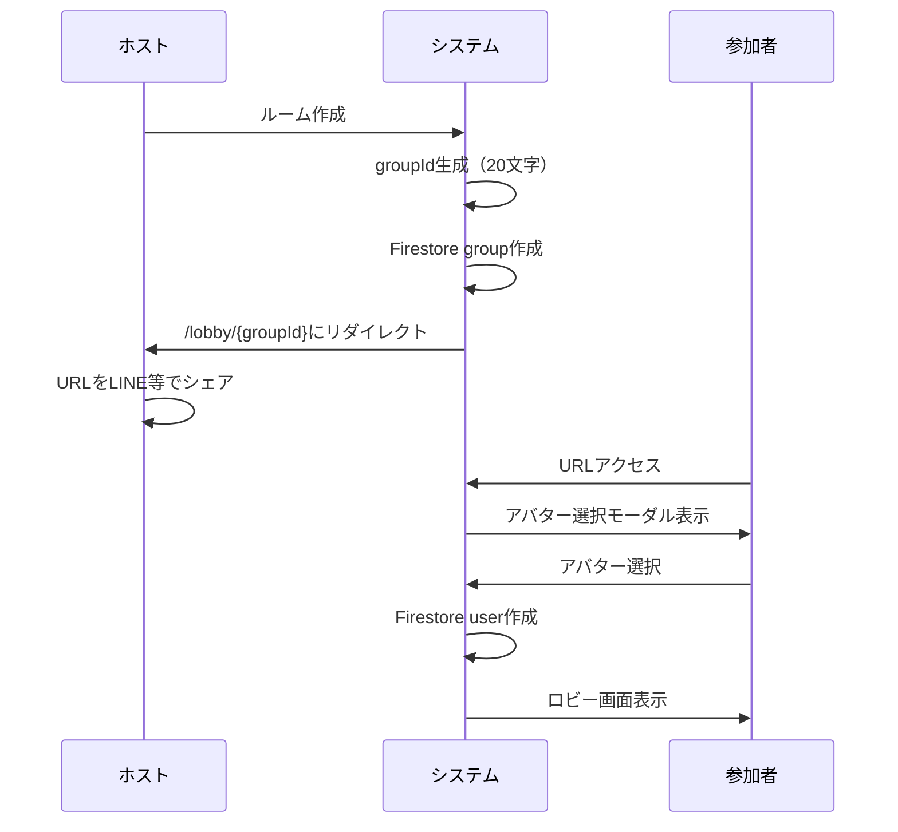
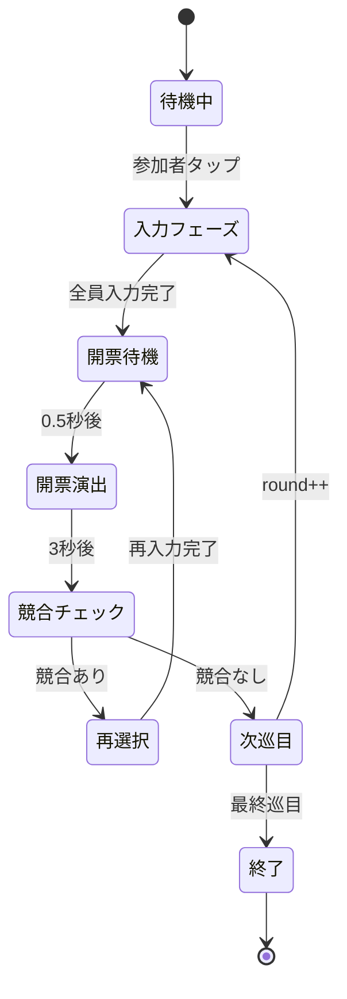

# オンラインドラフト会議 機能仕様書

## 🖥️ 画面構成

### 画面一覧
1. **トップページ** (`/`) - ルーム作成・参加の入り口
2. **ロビー画面** (`/lobby/[id]`) - 参加者待機・開始準備
3. **ドラフト実行画面** (`/draft/[id]`) - メインのドラフトゲーム画面（結果表示含む）

### モーダル・演出
- **開票演出モーダル** - スロット風の一斉開票演出
- **確認ダイアログ** - 退室確認等の各種確認
- **アバター選択モーダル** - 初回参加時のアバター選択
- **エラートースト** - 全画面共通エラー表示

### 画面遷移フロー
```
トップページ (/)
  ├─ [ルーム作成] → ロビー画面 (/lobby/[新規ID])
  └─ [ルーム参加] → ロビー画面 (/lobby/[既存ID])
                       ↓ [参加者タップ]
                 ドラフト実行画面 (/draft/[ID])
```

## 📱 UI仕様詳細

### 1. トップページ UI

#### レイアウト構成
画面中央に縦方向で配置された要素群で構成されます：

**ヘッダーエリア**：
- 大きなアプリタイトル「オンラインドラフト会議」
- サブキャッチ「みんなでワイワイ！リアルタイムドラフト」

**説明エリア**：
- URLシェアの簡単さを説明するテキスト
- 音声通話併用の説明
- 中央寄せで最大幅制限

**アクションエリア**：
- 大きな「ルーム作成」ボタン（青色・目立つデザイン）
- URL/ID入力欄と参加ボタンの横並び配置

#### 機能詳細
- **ルーム作成**: 
  - クリック時に新規groupIdを生成
  - Firestore上にグループドキュメント作成
  - 作成者のユーザー情報をuserコレクションに追加
  - `/lobby/[groupId]`に自動遷移
- **ルーム参加**:
  - URL形式: `https://domain.com/lobby/[groupId]`
  - groupId形式: 20文字のランダム文字列
  - 存在チェック後、アバター選択フローへ

### 2. ロビー画面 UI

#### レイアウト構成（スマホ）
縦方向に配置された2つのカードで構成：

**ルーム情報カード**：
- ルーム名を大きく表示
- 現在のURLと横にコピーボタン
- 「友達にシェアしよう！」ガイドテキスト

**参加者一覧カード**：
- 「参加者 (X人)」ヘッダー
- 2列グリッドで参加者表示
- 各参加者はアバター画像とユーザー名の横並び
- 薄いグレー背景のボックス形式
- 下部に「タップして開始」ガイド

#### 機能詳細
- **URL共有**:
  - クリップボードへの自動コピー
  - コピー成功時はトースト表示
  - QRコード生成（将来実装予定）
- **アバター選択**:
  - 初回参加時のみ表示
  - 1-18番から選択（99番はシステム用）
  - 他者使用中は選択不可
  - 選択後は変更不可
- **ドラフト開始**:
  - 任意の参加者カードをタップ
  - 最小2人から開始可能
  - ドラフト実行画面への遷移

### 3. ドラフト実行画面 UI

#### レイアウト構成（スマホ）
フルスクリーン高さの縦分割レイアウト：

**ヘッダー（固定）**：
- 左側：現在の巡目と入力状況カウンター
- 右側：参加者表示ボタン
- 白背景・下ボーダー付き

**タブエリア（可変）**：
- 2つのタブ：「取得リスト」「チャット」
- タブ内容はスクロール可能

**取得リストタブ内容**：
- アコーディオン形式で参加者ごとに展開
- ヘッダー：アバター、名前、取得数カウンター
- 内容：取得済みアイテム一覧とコメント

**チャットタブ内容**：
- メッセージ一覧（縦スクロール）
- アバター、ユーザー名、タイムスタンプ、メッセージ内容

**入力エリア（固定）**：
- アイテム名入力欄と送信ボタンの横並び
- 下にコメント入力欄（200文字制限）
- 白背景・上ボーダー付き

#### レイアウト構成（PC）
フルスクリーン高さの横分割レイアウト：

**左側エリア（60%幅）**：

**入力状況表示セクション**：
- グレー背景の固定エリア
- 2列グリッドで参加者の入力状況表示
- 各行：アバター、名前、完了/未完了アイコン

**取得済みリストセクション**：
- 2列グリッドで参加者カード表示
- 各カード：ヘッダー（アバター+名前+カウンター）+ 取得アイテム一覧

**右側エリア（40%幅）**：

**チャット・ログセクション**：
- 縦スクロール可能なメッセージ一覧
- 各メッセージ：アバター、ユーザー名、内容

**入力エリアセクション**：
- グレー背景の固定エリア
- 縦並び：アイテム名入力、コメント入力、送信ボタン

### レスポンシブ対応詳細
- **ブレイクポイント**: 768px（Chakra UIの`md`）
- **SP（〜767px）**: タブ形式、縦積みレイアウト
- **PC（768px〜）**: サイドバー形式、横分割レイアウト
- **タブレット**: PC版レイアウトを使用
- **実装**: Chakra UIの`useBreakpointValue`フック使用

## 🎮 ゲームフロー仕様

### 詳細ゲームフロー

#### 1. ルーム作成・参加フロー


#### 2. ドラフト実行フロー


#### 3. 各フェーズの詳細

**入力フェーズ**
- 参加者は自由なタイミングで選択肢を入力
- 入力完了者は即座に他参加者に通知
- 入力内容は他者から見えない（開票まで秘密）
- バリデーション: 空文字、50文字制限

**開票待機フェーズ**
- 全員の入力完了を待機
- 「開票準備中...」表示
- 0.5秒の演出準備時間

**開票演出フェーズ**
- スロット風文字回転演出（3秒間）
- 全参加者の選択が同時表示
- ランダム順序で停止
- 成功/失敗のビジュアルフィードバック

**競合チェック・再選択フェーズ**
- 同一アイテム選択者の自動検出
- randomNumber比較で勝者決定
- 敗者に再選択UI表示
- 競合なしの場合はスキップ

### 競合処理詳細

#### 競合検出アルゴリズム
競合解決の処理フロー：

1. **同一アイテム選択者の検出**：
   - 全選択情報をアイテム名でグループ化
   - 2人以上が同じアイテムを選択した場合を競合として判定

2. **勝者決定ロジック**：
   - 各選択時に生成されたrandomNumber（0〜1の乱数）で比較
   - 最も小さい値を持つユーザーが勝者
   - 残りは敗者として再選択対象

3. **競合情報の返却**：
   - アイテム名、勝者ID、敗者IDリストを含む競合情報を返却

#### 競合時のUI状態
- **勝者**: `✅ 獲得成功！ {アイテム名}`
- **敗者**: `❌ 競合で失敗... 別のアイテムを選択してください`
- **チャットログ**: `⚡ 競合発生！{アイテム名} → {勝者名}が獲得`
- **再選択**: 敗者のみ入力欄を再表示、他者は待機状態

#### randomNumber生成
選択送信時の処理内容：

- アイテム名、コメント、巡目、ユーザーIDと共にrandomNumberを生成
- randomNumberはMath.random()で0.0〜0.999...の範囲の乱数
- 全ての選択情報はFirestoreのサーバータイムスタンプ付きで保存

## 🎭 演出仕様

### 開票演出
- **方式**: スロット風演出
- **表示**: 全員分同時表示
- **音**: なし
- **アニメーション時間**: 150ms統一（Framer Motion使用）

### 演出フロー例
```
【第1巡目 開票中...】
田中太郎: 🎰 ガチャガチャ...
山田花子: 🎰 ガチャガチャ...

↓ (順番に止まっていく)

田中太郎: 大谷翔平 ✅
山田花子: 大谷翔平 ❌ (競合！)
```

## 🗄️ データモデル（Firestore）

### コレクション構造
- `app/onlinedraft/group/{groupId}`
- `app/onlinedraft/user/{userId}`
- `app/onlinedraft/selection/{userId}`

### group コレクション
グループ（ルーム）の基本情報を管理：

**基本フィールド**：
- groupId：20文字のランダム文字列
- groupName：ルーム名
- deleteFlg：論理削除フラグ
- finishedRound：完了巡目の配列
- round：現在巡目番号

**新規追加フィールド**：
- createdAt/updatedAt：作成・更新日時
- status：waiting（待機）/playing（進行中）/finished（終了）

### user コレクション
参加ユーザー情報を管理：

**基本フィールド**：
- userId：Firebase Anonymous AuthのUID
- userName：参加時入力のユーザー名
- groupId：所属ルームID
- avatar：選択したアバター番号（1-18）

**新規追加フィールド**：
- joinedAt/updatedAt：参加・更新日時
- isActive：接続状態フラグ

### selection コレクション
各ユーザーの選択履歴を管理：

**配列構造**：
- selection配列：各巡目の選択情報を格納
- 各要素：アイテム名、コメント、巡目、ユーザーID、乱数値
- success：競合解決後の取得成功フラグ

**メタデータ**：
- createdAt/updatedAt：作成・更新日時

## 🔄 リアルタイム同期

### 監視対象
- **参加者の増減**: user コレクション
- **入力状況**: selection コレクション
- **巡目の進行**: group.round

全てFirestoreのリアルタイムリスナーで監視・同期

## 🎯 状態管理（Jotai）

### 主要なatom設計（予定）
- `currentUserAtom`: 現在のユーザー情報
- `groupAtom`: グループ情報
- `participantsAtom`: 参加者一覧
- `selectionsAtom`: 全選択情報
- `currentRoundAtom`: 現在の巡目
- `inputStatusAtom`: 入力状況

## 🔍 バリデーション・エラーハンドリング

### 入力値バリデーション

#### アイテム名バリデーション
入力必須チェックと文字数制限：
- 空文字・空白のみの場合：「アイテム名を入力してください」
- 50文字超過の場合：「アイテム名は50文字以内で入力してください」
- 有効な場合：バリデーション通過

#### コメントバリデーション
文字数制限のみ：
- 200文字超過の場合：「コメントは200文字以内で入力してください」
- 空文字は許可（任意入力）

#### ユーザー名バリデーション
入力必須チェックと文字数制限：
- 空文字・空白のみの場合：「ユーザー名を入力してください」
- 20文字超過の場合：「ユーザー名は20文字以内で入力してください」
- 有効な場合：バリデーション通過

### エラーハンドリング

#### Firestore接続エラー
データベース操作エラーの種類別処理：

**権限エラー（permission-denied）**：
- 表示：「権限エラー - この操作は許可されていません」
- 対応：エラートースト表示

**接続エラー（unavailable）**：
- 表示：「接続エラー - インターネット接続を確認してください」
- 対応：エラートースト表示

**その他のエラー**：
- 表示：「予期しないエラーが発生しました」
- 対応：コンソールログ出力 + エラートースト

#### リアルタイム接続断
リアルタイムリスナーのエラーハンドリング：

**接続断発生時**：
- 警告トースト：「接続が切れました - 再接続を試行中...」
- 3秒後に自動再接続試行
- コンソールにエラーログ出力

**再接続成功時**：
- 成功トースト：「接続が復旧しました」
- データの再同期実行

### URL・ルーム検証

#### groupId検証
ルームIDの妥当性検証プロセス：

**形式チェック**：
- 正規表現：英数字20文字の組み合わせ
- 無効な場合：「無効なルームIDです」

**存在チェック**：
- Firestoreでドキュメントの存在確認
- 存在しない場合：「ルームが見つかりません」

**削除フラグチェック**：
- deleteFlgがtrueの場合：「このルームは削除されています」
- 有効な場合：検証通過

## 🧪 テスト仕様

### ユニットテスト対象

#### カスタムフックテスト
**useDraftRoomフック**：
- 正常系：有効なgroupIdでドラフトデータを取得
- 異常系：無効なgroupIdでエラーを返却
- 日本語テスト命名必須

#### 競合解決ロジックテスト
**競合解決アルゴリズム**：
- 同一アイテム選択時のrandomNumber比較
- 最小値ユーザーが勝者になることを検証
- 複数競合パターンのテスト

### E2Eテスト仕様

#### 基本フローテスト
**ドラフト基本フロー**：
1. トップページでルーム作成
2. 別タブで参加URL経由の参加
3. ドラフト開始操作
4. アイテム選択・送信
5. 開票結果確認

**テスト方針**：
- ハッピーパスメイン（5:1の比重）
- Chrome単体での実行
- 日本語テスト命名

## 📊 パフォーマンス最適化

### リアルタイム同期最適化

#### 差分更新戦略
**選択データの効率的更新**：
- 配列全体ではなく、特定インデックスのみ更新
- Firestoreのフィールドパス指定で部分更新
- サーバータイムスタンプによる更新日時管理

#### キャッシュ戦略
**Jotaiでの状態キャッシュ**：
- 参加者データの差分比較
- 変更のあった部分のみ状態更新
- 不要な再レンダリングの防止

### バンドルサイズ最適化

#### Dynamic Import戦略
**コンポーネントの遅延ロード**：
- 開票演出モーダルの遅延ロード
- 初回表示時のみインポート
- ローディング中はスピナー表示
- SSR無効化でクライアントサイド専用

---

*この機能仕様書は、プロジェクトの進行とともに継続的に更新・改善されます。*
*最終更新: 2025年6月*